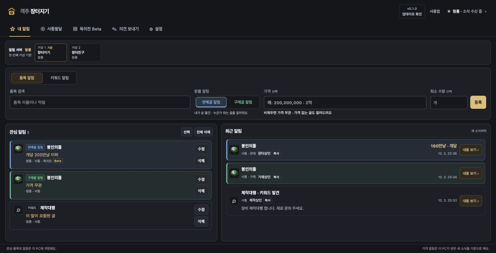
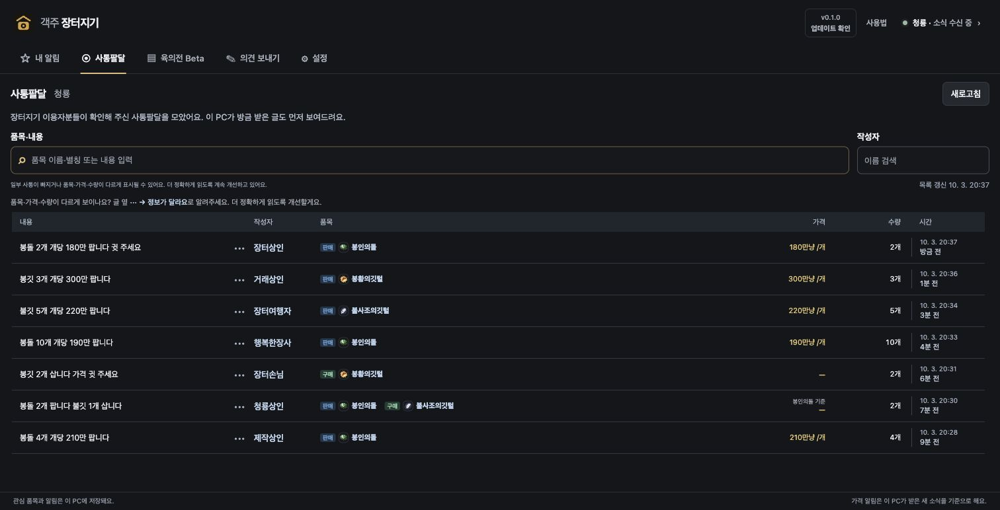

  
  <h1>객주 장터지기</h1>
  
원하는 거상 거래 소식을 Windows 알림으로 받아보세요.

  
<strong>Windows 11 · 로그인 없이 사용 · 자동 업데이트</strong>

  
<a href="https://github.com/gaekjuju/gaekju-jangteojigi/releases/download/companion-v0.1.13/Gaekju-Jangteojigi_0.1.13_x64-setup.exe"><strong>Windows 설치 파일 받기</strong></a> · <a href="https://gaekju.app">객주 바로가기</a>

---

## 원하는 품목과 가격을 등록하면, 새 사통을 알려드려요

품목을 고르고 **판매글 알림** 또는 **구매글 알림**을 등록하세요. 조건에 맞는 새 사통이 오면 Windows 알림과 앱의 **최근 알림**에서 확인할 수 있어요.

- **사고 싶을 때:** 판매글 알림을 고르고 원하는 가격 이하로 설정해요.
- **팔고 싶을 때:** 구매글 알림을 고르고 원하는 가격 이상으로 설정해요.
- **가격과 관계없이 보고 싶을 때:** 가격을 비워두세요.

## 이름으로도, 별칭으로도 쉽게 검색하세요

**봉인의돌**은 물론 **봉돌**로도 검색할 수 있어요. 객주와 같은 품목·아이콘을 보고 선택해 등록하세요.

품목을 고르는 알림 외에 **제작대행**처럼 원하는 말이 포함된 사통을 알려주는 **키워드 알림**도 있어요.

## 사통팔달을 한눈에 찾아보세요

서버에 모인 사통팔달을 볼 수 있어요. **품목·내용**과 **작성자**로 검색하고, 품목·가격·수량·시간을 함께 확인하세요.

조회할 서버를 따로 고를 수 있고, 알림은 상단에서 설정한 서버로 받아요. 작성자나 품목을 누르면 해당 소식만 모아 볼 수 있어요.

## 시작하는 방법

1. 위 **Windows 설치 파일 받기**를 눌러 내려받고 실행하세요.
2. **Npcap**이 없으면 장터지기의 안내에 따라 설치하세요.
3. 상단에서 알림 받을 서버를 선택하세요. 아직 선택하지 않았다면 확인된 접속 서버가 하나일 때 자동으로 설정해요.
4. 관심 품목 또는 키워드를 등록하세요.

## 켜두면 편한 기능

- **시작프로그램:** Windows를 켜면 트레이에서 시작해요. 설정에서 켜거나 끌 수 있어요.
- **트레이 실행:** 닫거나 최소화해도 소식을 받아요. 트레이 아이콘을 두 번 누르면 창이 열려요.
- **자동 업데이트:** 새 버전을 확인해 내려받고, 앱에서 설치를 안내해요.
- **관심 조건 보관:** 등록한 품목과 조건은 이 PC에 저장돼요.

## 함께 더 정확하게 만들어가요

사통의 품목·가격·수량을 더 정확하게 읽도록 계속 개선하고 있어요. 정보가 다르면 글 옆 **··· → 정보가 달라요**로 알려주세요. 사용 중 떠오른 의견은 **의견 보내기** 탭에서 보낼 수 있어요.

자료 제공은 설정에서 선택할 수 있어요. 참여하지 않아도 개인 알림을 사용할 수 있어요.

화면은 현재 장터지기에 예시 거래 글과 캐릭터 이름을 넣어 캡처했어요.
